<h1 align="center">TriageMate</h1>
<h2 align="center">(BCS Hacks 2025)</h2>

<h4 align="center">
  An AI-driven approach to streamline hospital triage. <br>
  Empowering patients, supporting providers.
</h4>

<p align="center">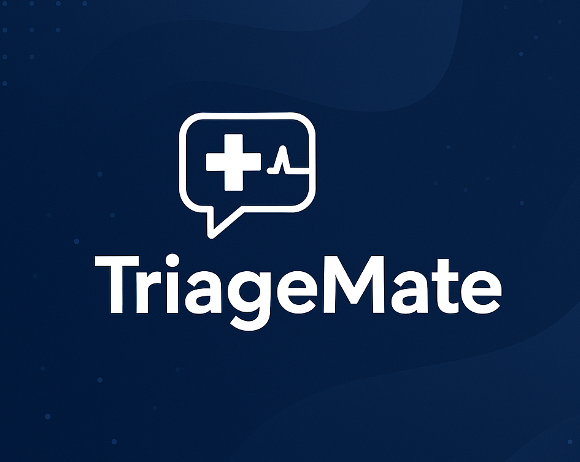</p>

<p align="center">
  <a href="https://devpost.com/software/TriageMate">Devpost</a> &nbsp;|&nbsp; <a href="https://expo.dev/preview/update?message=Fix+runtime+version+for+Expo+Go&updateRuntimeVersion=exposdk%3A54.0.0&createdAt=2026-07-27T08%3A13%3A22.863Z&slug=MyApp&projectId=cf16b210-63e0-41f2-aa9f-bb608c547c7e&group=f7ad462d-40d1-43ca-b36b-a7763517ac99">Live Demo (Expo Go)</a>
</p>

<br>

## Table of Contents
- [Contributors](#contributors)
- [Problem Statement](#problem-statement)
- [Overview](#overview)
- [User Flow](#user-flow)
- [Features](#features)
- [Tech Stack](#tech-stack)
- [How It Works](#how-it-works)
- [Technical Challenges and Achievements](#technical-challenges-and-achievements)
- [Future Improvements](#future-improvements)
- [Getting Started](#getting-started)

<br>

## Contributors
- Jennifer Wong
- Stephanie Xue
- Vincent Tu

<br>

## Problem Statement

TriageMate was inspired by a shared recognition of the communication gaps and inefficiencies that can affect hospital care. One of our team members recently accompanied a family member to the emergency department at Vancouver General Hospital after she experienced significant bleeding. Because she was unable to communicate in English, important details about her condition were not fully conveyed during intake, contributing to a lengthy wait and misunderstandings when she was assessed by a physician.

Our team has also seen how language barriers and unclear symptom communication can create challenges for both patients and healthcare providers. These experiences highlighted the need for a tool that helps patients describe their symptoms in their preferred language while presenting healthcare professionals with clear, structured information for triage.

Communicating health concerns can be difficult, especially when symptoms are complex, emotions are heightened, or language barriers are present. TriageMate was created to help patients communicate more confidently and accurately while supporting healthcare providers with concise, meaningful triage reports. By improving how symptom information is captured and presented, the application aims to make hospital triage more accessible, efficient, and patient-centered.


<br>

## Overview

This project is a full-stack mobile application that uses AI to streamline symptom reporting and hospital triage. Users can speak or type their symptoms in any language using their phone’s native speech-to-text keyboard, after which the application translates the input into English when necessary, identifies relevant risk factors and potential red flags, and organizes the information into a concise triage report for healthcare providers to review. The frontend is built with React Native and TypeScript using the Expo framework, with the Expo Go application used for mobile development and testing. The backend is built with Node.js and Express.js, while MongoDB is used for data storage. The Google Gemini API processes each free-text symptom description and generates a structured report containing the chief complaint, symptom details, risk factors, and potential red flags. The application's backend is deployed on Render for cloud hosting, allowing the mobile application to be accessed directly through the Expo Go application without requiring any local setup.

<br>

## User Flow

The application guides users through a simple symptom-reporting process, from entering the application to reviewing and submitting their completed triage report. Users begin on the landing screen and proceed to the symptom input screen, where they can describe their symptoms or health-related concerns by typing or using their phone’s native speech-to-text keyboard. After the input is submitted, the application processes the description and generates a structured triage report. Users can then review the extracted information, confirm that it accurately reflects their concerns, and complete the submission. A separate profile screen allows users to view the patient information associated with the report.

<p align="center">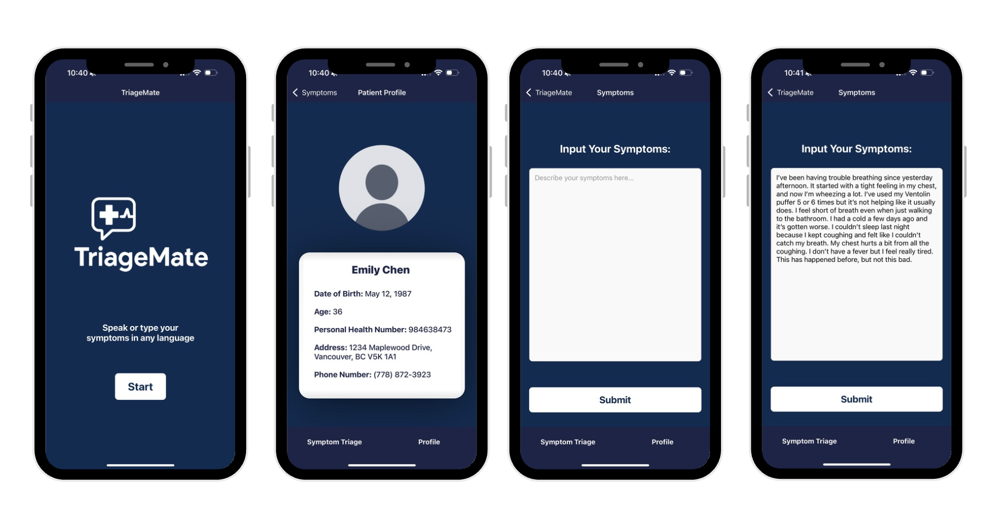</p>

<p align="center">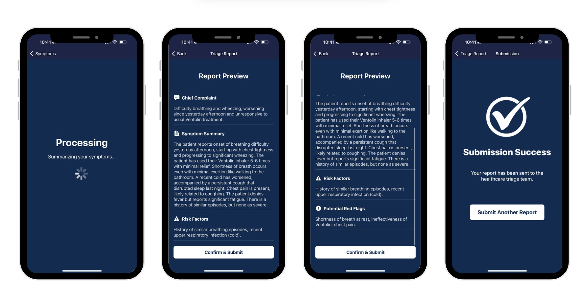</p>

<br>

## Features

### Landing Screen

Introduces users to the application through a clean, accessible interface and guides them to begin describing their symptoms and health concerns.

<p align="center">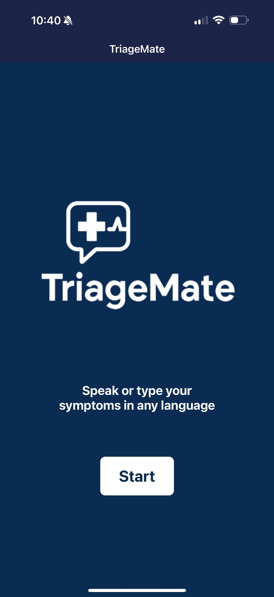</p>

<br>

### Profile Screen

Displays the patient information associated with the triage submission, including their name, date of birth, age, personal health number, address, and phone number. The screen organizes key demographic details in a clear format so they can be reviewed alongside the patient’s symptom report.

<p align="center">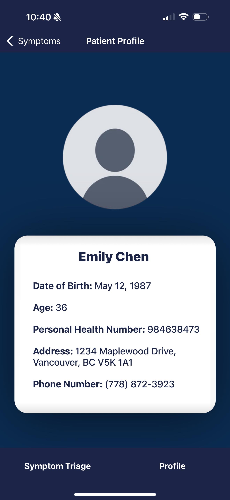</p>

<br>

### Symptom Input Screen

Allows users to describe their symptoms through typed text or their phone’s native speech-to-text keyboard. The open-ended input field gives users the flexibility to explain their symptoms, concerns, and relevant context in their own words rather than selecting from a limited set of predefined options.

<p align="center">
  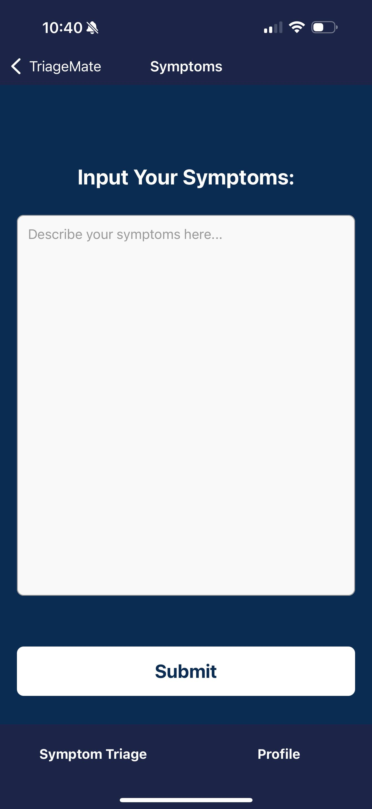
  &nbsp;&nbsp;&nbsp;&nbsp;&nbsp;&nbsp;&nbsp;&nbsp;&nbsp;&nbsp;
  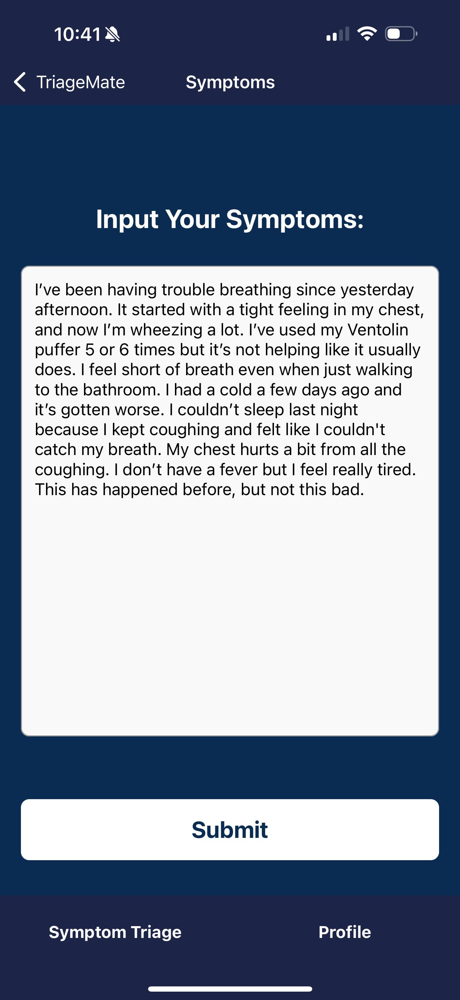
</p>

<br>

### Processing Screen

Provides visual feedback while the submitted symptom description is translated, analyzed, and converted into a structured triage report. The processing screen creates a clear transition between symptom entry and the completed report while the backend handles the request.

<p align="center">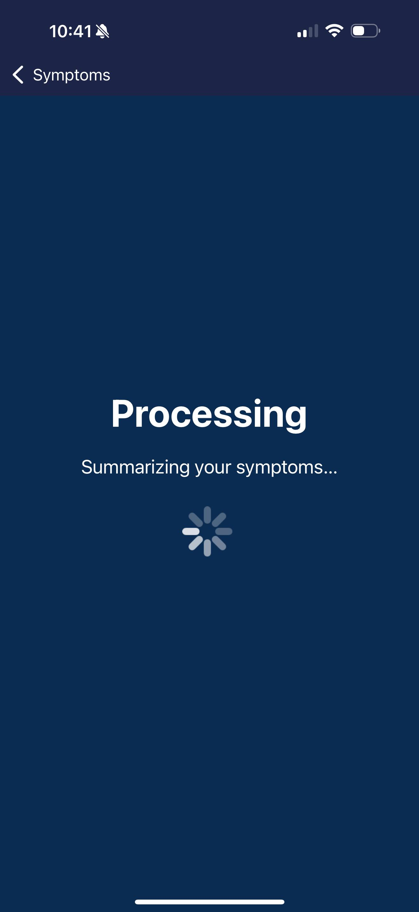</p>

<br>

### Triage Results Screen

Displays the generated triage report in a clear, structured format containing the patient’s chief complaint, symptom summary, relevant risk factors, and potential red flags. The screen separates clinically relevant information into distinct sections, allowing users to review the report and confirm that their symptoms and concerns have been represented accurately before completing the submission.

<p align="center">
  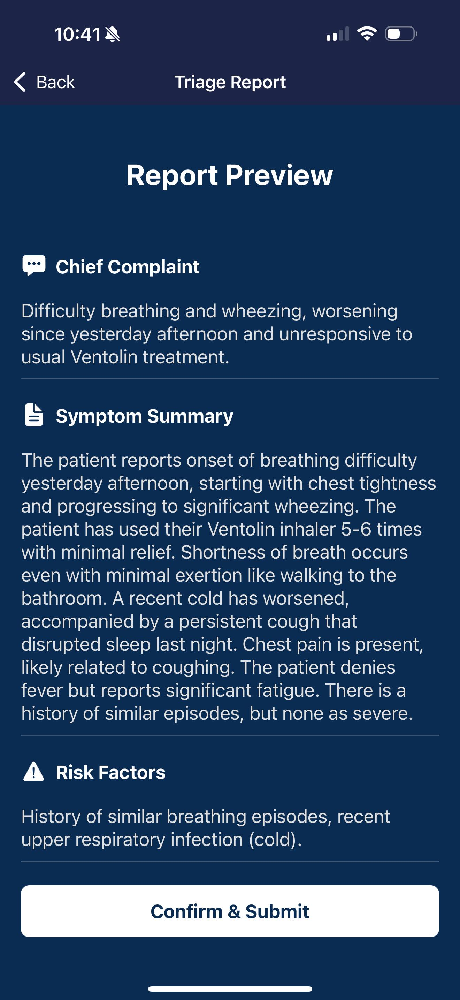
  &nbsp;&nbsp;&nbsp;&nbsp;&nbsp;&nbsp;&nbsp;&nbsp;&nbsp;&nbsp;
  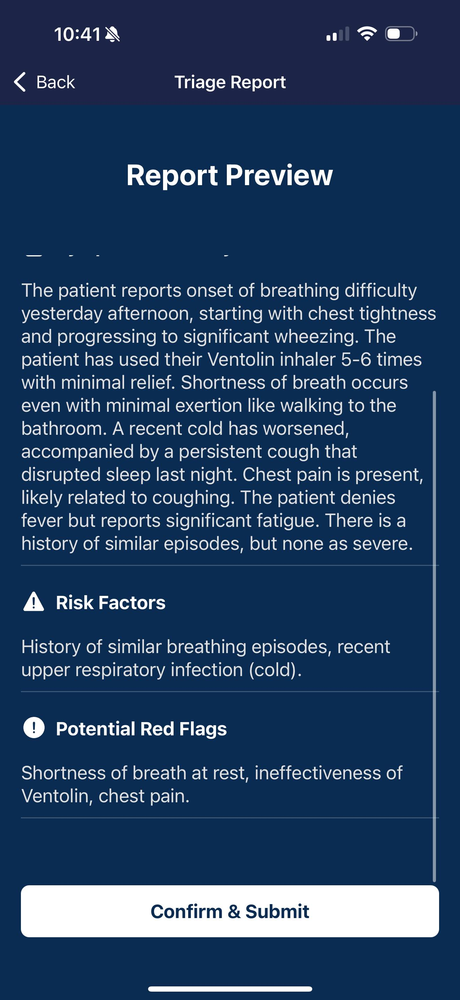
</p>

<br>

### Submission Confirmation Screen

Confirms that the triage report has been successfully submitted for review by healthcare providers. The screen gives users clear feedback that their information has been received and is ready to support the provider’s in-person assessment.

<p align="center">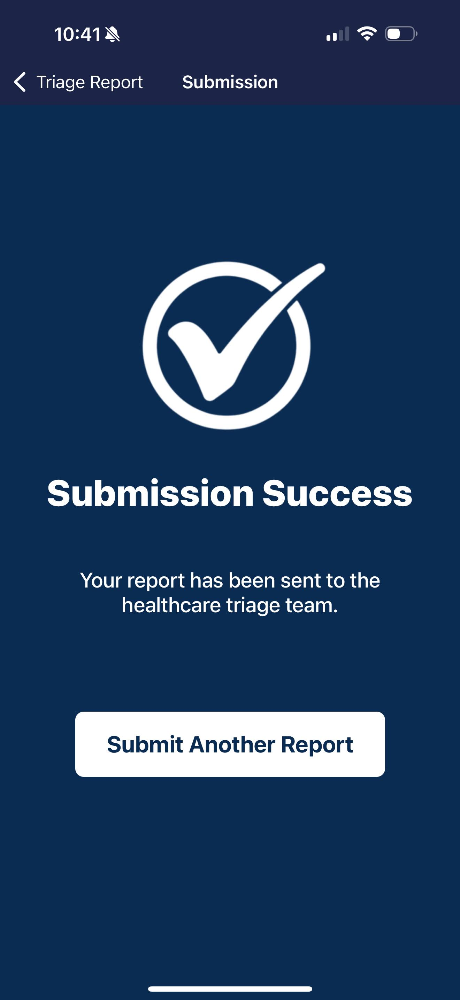</p>

<br>

### Multilingual Support

Supports symptom descriptions in languages other than English, helping reduce communication barriers during triage. Multilingual input is translated into English before being analyzed and structured, allowing the resulting report to remain clear and consistent for healthcare providers while patients communicate in their preferred language.

<p align="center">
  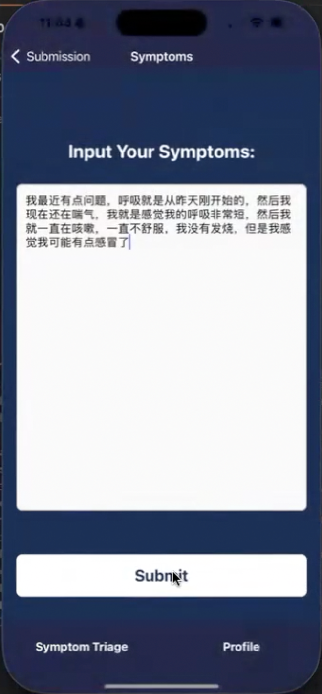
  &nbsp;&nbsp;&nbsp;&nbsp;&nbsp;&nbsp;&nbsp;&nbsp;&nbsp;&nbsp;
  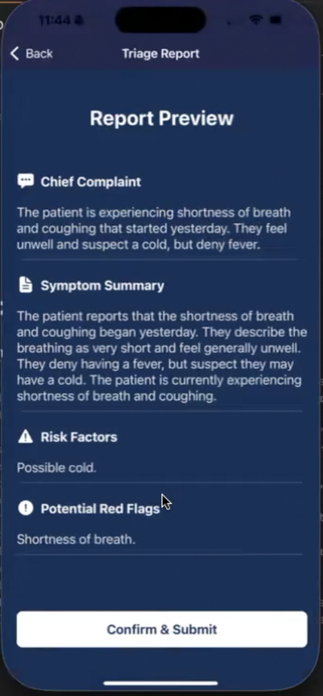
</p>

<br>

## Tech Stack

| Layer | Technologies |
|---|---|
| Frontend | React Native, TypeScript |
| Backend | Node.js, Express.js |
| APIs | Google Gemini API (translates and organizes user symptoms and health-related concerns into structured reports) |
| Database | MongoDB |
| Development and Testing | Expo Go |
| Deployment | Render |

<br>

## How It Works

The frontend is a React Native application built with Expo and TypeScript, made up of separate screens for the landing page, patient profile, symptom input, processing, results, and submission confirmation, with a navigation bar allowing users to move between the symptom triage flow and their profile. On the symptom input screen, users can speak using their phone's native speech to text keyboard or type directly into a text field. When a user submits a symptom description, the application sends it to the backend, which builds a detailed prompt instructing the Google Gemini API to translate the text into English if needed, triage it for risk factors and red flags, and structure the result into a report covering the chief complaint, symptom details, risk factors, and red flags, returned as JSON. The backend parses that JSON, saves the original text and structured report to MongoDB through a Mongoose schema, and sends the result back to the app, which displays it on the results screen for the user to review. Confirming the report on the results screen navigates to a submission confirmation screen, while the underlying report has already been saved to the database as part of the initial request.

<br>

## Technical Challenges and Achievements

- Most of the team had never worked with React Native or built a mobile application before, so setting up the development environment with Expo and running the application smoothly through Expo Go was a significant first hurdle
- Connecting the frontend to the backend on a mobile device required careful debugging, since the application needed to reach a backend server over the local network rather than simply calling localhost
- Navigating merge conflicts and platform-specific issues as a team while working under a tight hackathon timeline
- Successfully built a multilingual AI-powered triage system that translates and parses user symptoms from any language, aimed at improving accessibility for diverse patient populations
- Learned how to prompt engineer a healthcare-related task, specifically extracting only clinically relevant details from free text input and structuring it into a consistent, well-formed triage report

<br>

## Future Improvements
Several enhancements are planned to extend the functionality of the application:
- Secure user authentication and persistent patient profiles tied to real accounts
- Direct integration with electronic health record systems or healthcare provider dashboards
- Animations, accessibility features, and a more dynamic report visualization on the frontend

<br>

## Getting Started

There are two ways to run TriageMate: Open it directly in the Expo Go application (the backend is deployed on Render), or build and run the project locally on your own machine.

<br>

### Option 1: Open It Directly In the Expo Go Application (Easiest)

Setup only requires downloading the Expo Go application and creating a free Expo account. The backend is already deployed on Render, so there's nothing else to configure.

1. Download the Expo Go application on your iOS or Android device from your device's app store, then create a free Expo account or sign in if you already have one.
2. Open this link on your phone to launch the application: https://expo.dev/preview/update?message=Fix+runtime+version+for+Expo+Go&updateRuntimeVersion=exposdk%3A54.0.0&createdAt=2026-07-27T08%3A13%3A22.863Z&slug=MyApp&projectId=cf16b210-63e0-41f2-aa9f-bb608c547c7e&group=f7ad462d-40d1-43ca-b36b-a7763517ac99

> **Note:** The backend spins down when idle, so the first symptom submission may take up to a minute while the server wakes up. Subsequent requests will be much faster.

<br>

### Option 2: Build and Run It Locally

Follow the steps below to set up and run the application on your own machine. This project requires both a frontend Expo server and a backend server running at the same time, along with the Expo Go application installed on your phone.

<br>

**Prerequisites**

Make sure Node.js v20.19.4 or later is installed before you begin. You can check by running the command below, which should print a version number.
```bash
node --version
```

Download the Expo Go application on your iOS or Android device from your device's app store.

<br>

**1. Clone the repository**

This downloads a copy of the project to your computer and moves you into the project folder.
```bash
git clone https://github.com/steph-xue/TriageMate.git
cd TriageMate
```

**2. Set up environment variables**

Create a `.env` file inside the `backend` folder with the following values.
```bash
ATLAS_URI="mongodb+srv://your-mongo-uri"   # MongoDB Atlas connection string
GEMINIAI="your-gemini-api-key"             # Gemini API key from Google AI Studio
```

**3. Configure network access**

Make sure your computer and phone are connected to the same Wi-Fi network. In `app/input.tsx`, replace the backend URL (which points at the deployed Render backend by default) with your computer's local IP address (for example, `http://192.168.1.xxx:3000`), so your phone can reach your local backend server instead.

**4. Install backend dependencies**

From the project root, move into the backend folder and install its dependencies.
```bash
cd backend
npm install
```

**5. Start the backend server**

Still inside the backend folder, start the server.
```bash
node app.js
```

**6. Install frontend dependencies**

In a separate terminal, from the project root, install the frontend dependencies.
```bash
npm install
```

**7. Start the frontend Expo server**

This runs the Expo development server for the mobile application.
```bash
npx expo start
```

Once both servers are running, the Expo terminal will display a QR code. Scan it with your phone's camera to open the application in the Expo Go application.